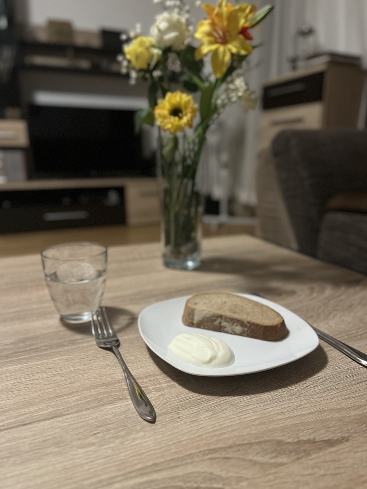

+++
title = "Wenn das Essen zur Last wird"
date = "2024-06-11"
draft = true
pinned = false
tags = ["Rapertage", "deutsch", "Essstörung", ""]
+++

Zuerst nur ein bedrückendes Gefühl, dann das Berechnen der Kalorien, später das Auslassen von Mahlzeiten und schlussendlich zur Diagnose einer Essstörung.  

Viele Menschen in unserer Gesellschaft haben Schwierigkeiten, sich ausgewogen zu ernähren: Sie essen, um sich zu beruhigen, um Ärger oder Stress runterzuschlucken. Oder sie verbieten sich bestimmte Lebensmittel und essen nach strengen, selbst erstellten Regeln. Kurzfristig hat man ein Gefühl von Erleichterung, aber langfristig bilden diese Handlungen unbewusst einen suchtartigen Charakter. Essstörungen sind sehr vielfältig, doch eine Gemeinsamkeit ist, dass die Gedanken der betroffenen Personen ständig um das Essen kreisen. Die drei klassischen Essstörungen, laut dem Sachbuch: Essstörungen Hilfe bei Anorexie, Blumie und Binge-Eating, sind: Anorexia (Magersucht), Bulimia nervosa, diese ist oft mit der Einnahme von Medikamenten verbunden, (Ess-Brech-Störung) und die Binge-Eating-Störung (Essanfallstörung) aber es gibt viele weitere Essstörungsarten, welche jedoch nicht so häufig anzutreffen sind.

#### 
„Wenn man keine Kontrolle mehr über die Ernährung hat und wenn es das Leben so einschränkt und beeinflusst, dass man nur noch daran denkt", 

lautet die Beschreibung einer Essstörung von Frau Pasquier, eine Expertin in diesem Bereich.

###### 
Wie verläuft die Entwicklung einer Essstörung, wie sieht der Alltag einer Betroffenen Person aus und welche Gefahren stossen auf sie zu?

Eine Person, die eine Essstörung beziehungsweise eine Magersucht miterlebt hat, hat sich dazu bereitgestellt ihre Erfahrungen und Gedanken mit uns in einem Interview zu teilen. Die betroffene Person will anonym bleiben, aus diesem Grund werden wir sie Sarah nennen. 

Während dem Lockdown hat es bei ihr mit der Entwicklung eines ungesunden Verhältnisses zu ihrem Körper angefangen. Sie hat sich mit den Schönheitsidealen verglichen und hat angefangen, sich damit zu beschäftigen, dass sie anders aussehen will. 
Wir haben Frau Angélique Pasquier, zu dem Thema Essstörung interviewt. Sie bestätigt, dass es bei den meisten Betroffenen auch mit einer Körperwahrnehmungsstörung zusammenhänge. Kurze Zeit später hat Sarah angefangen auf süsse und ungesunde Sachen, wie Chips, zu verzichten. 
Eines Tages ist ein Kommentar von ihrem Vater gekommen, der damals eine spezifische Vorstellung gehabt hat, wie ein Frauenkörper aussehen soll, indem er sie fragt, ob sie zugenommen habe. Sarah hat sich mit der Veränderung ihres Körpers nicht mehr wohl gefühlt. Damals ist sie im Pubertätsalter gewesen, in dem es normal ist, dass sich der weibliche 

Körper anfängt zu verändern. Unsere Expertin gibt an, dass die meisten Auslöser einer Essstörung in der Pubertät aufträten. Ebenfalls bei Leistungssportlerinnen trete die Störung häufiger auf. Auch durch familiäre Situationen bestehe die Gefahr, dass die Störung ausgelöst werden könne. Dieser zuvor erwähnte Kommentar führt sie dazu, wieder nach langer Zeit auf die Waage zu stehen. Beim Anblick ihres Gewichtes sagt sie, sei sie erschrocken. Sie habe den Entschluss gefasst einige Kilos abzunehmen, um sich in ihrem Körper wieder wohlzufühlen. 

Ab diesem Zeitpunkt ist der Kontrollwahn bei Sarah ausgebrochen. Dieser hat sich immer weiterentwickelt. Sie hat sich jeden Tag gewogen, immer weniger gegessen und auf alle Kohlenhydrate verzichtet. Ihre Ernährung besteht nur noch aus Obst, Gemüse und leichten Proteinen. Sie kann mit kleinen Gewichtsschwankungen von einem Tag zum anderen nicht mehr umgehen, weil sie sich angewöhnt hat, dass ihr Gewicht immer runter geht. Bei vielen verläuft die Gewichtsabnahme langsamer, dadurch merkt das Umfeld erst später, dass die Person unter einer Essstörung bzw. einer Anorexia leidet. Viele Betroffene haben Cheat-Days, in denen das Verlangen nach dem Essen zu gross wird, sodass sie ihrem Verlangen nachgeben, wird im Sachbuch, Essstörungen Hilfe bei Anorexie, Blumie und Binge-Eating, erwähnt. Bei Sarah ist es schneller gegangen, weil sie immer weniger Essen zu sich genommen hat. Sie gelangt an den Punkt, an dem sie nur noch 100 Kalorien am Tag zu sich nimmt, im Vergleich sind das etwa 2 Äpfel.  Sie weiss, dass man täglich etwa 2000 Kalorien zu sich nehmen soll, aber diesen Fakt hat sie ignoriert. Sie ist ins Gerätturnen gegangen, aber seitdem es mit der Essstörung begonnen hat, macht sie immer mehr Sport und geht zusätzlich joggen um das Essen, das sie zu sich genommen hat auszugleichen. Es geht so weiter bis ihr Hausarzt ihr verbietet Sport zu machen. Daran hält sie sich, doch isst sie dafür weniger. Einige Betroffene treiben übermässig Sport, um Fett zu verbrennen. Da sie kein Fett mehr haben aber trotzdem weiter machen, verbrennen sich ihre Muskeln, sodass sie fast nur noch Haut und Knochen haben. 
Im Sommer 2022 merkt die Familie von Sarah, dass etwas mit ihrer Ernährung nicht stimmt. Daraufhin gehen sie zum Hausarzt, bei dem sie regelmäßig gewogen wird. Sie wird zum Psychiater geschickt. Dieser hilft ihr aber nicht, weil Sarah der Meinung ist, dass mit ihrem Essverhalten nichts falsch sei. Viele Patienten reden sich ein, dass nichts mit ihrem Essverhalten falsch ist, obwohl sie tief im Inneren wissen, dass sie ungesund leben. 
Sie landet im Notfallspital, da ihr Gesundheitszustand immer schlimmer geworden ist. Weil sie sich weigert, ihr Essverhalten zu verbessern, sinkt ihr Gewicht noch mehr. Es ist sogar dazu gekommen, dass ihre Schilddrüse nicht mehr funktioniert hat. Daraufhin bekommt sie eine Magensonde. Wegen ihres schlechten Zustandes muss sie anfangen ihr Gewicht zu stabilisieren. 
In ihrem Zimmer sitzt sie allein und im Spitalbett fühlt sie sich gefangen. Sie darf nicht raus und jeden Morgen wacht sie auf und sieht die genau gleichen weissen Wände, die sie gestern gesehen hat. Jeden Tag bringt ihr eine Pflegefachperson ihr Essen, welches sie nicht mag. Sie befindet sich in einem miserablen Zustand. Sarah meint, sie habe sich sehr einsam gefühlt und dass die Pflege nicht genug auf psychische Hilfe ausgebildet sei. Emotional ist es ihr während dem Aufenthalt im Spital schlimmer gegangen als bei ihr zuhause. Aber im Spital hat man sich eher auf ihre körperliche Gesundheit konzentriert. Den Ärzten ist es klar geworden, dass Sarah einen spezialisierten Aufenthalt nötig hat. An dieser Stelle wollen wir anmerken, dass die Behandlung von Spital zu Spital unterschiedlich ist. 

Sie ist in die Klinik Wysshölzli aufgenommen worden. Diese Klinik ist spezialisiert für Patienten mit einer Esssucht, und dort sind nur weibliche Patienten zu finden. Die Magersucht ist eher eine Frauenkrankheit, da in unserer Gesellschaft das Aussehen einer weiblichen Person eine höhere Bedeutung hat als das eines Mannes.
Am 2. November 2023 ist Sarah in die Klinik gegangen, sie fühlt sich am Anfang ein wenig verloren, weil sie nicht weiss, wie eine Klink funktioniert. Mit der Zeit findet sie die Klinik besser, weil man dort sein eigenes Zimmer hat, die richtige Pflege und der Fokus auf der psychischen Gesundheit liegt. Am Anfang weigert sie sich zu Essen, weil sie davon überzeugt ist, dass sie keine Hilfe braucht. Sie hat sich eingeredet, dass sie kein Gericht mehr gernhat, damit sie nichts mehr isst und die Kalorien unter Kontrolle hat. Frau Pasquier erklärt, dass die meisten Patienten grosse Angst haben, die Kontrolle zu verlieren. Es geht so weit, dass sie sich von jedem alltäglichen Lebensmittel die Kalorienzahl merken. 
In der ersten Woche darf Sarah keinen Besuch bekommen, deshalb ist sie einsam. Aber im Nachhinein findet sie, dass es ihr geholfen hat zu merken, wie schlecht es ihr gegangen ist. Die Pflegerinnen können Sarah helfen sich geborgen zu fühlen, da sie ausgebildet sind mit den Patienten sanft, umzugehen.
Nach einer Rücksprache mit ihrem Arzt liegt sie in ihrem Bett und betrachtet aus dem Fenster den blauen Himmel. Der Arzt hat ihr klar gemacht, dass wenn sie so weiter macht, dies zu ihrem Tod führen kann. Sie ist in sich gegangen und hat nach langem Überlegen den Entschluss gefasst: 

#### "Ich habe mich in diesem Moment bewusst gegen den Tod entschieden, aber nicht ganz für das Gesund werden."

Frau Pasquier, die als Pflegefachperson gearbeitet hat, meint auch, dass die Patienten keinen Besuch haben dürften, sodass sie selbst merken, dass es ihnen schlecht gehe und dass sie die Hilfe nötig haben. 
An einem späteren Tag kommt ihre Mutter sie besuchen, diese weint lange über ihre Tochter. Der emotionale Zustand ihrer Mutter trifft sie stark und holt sie zurück in die Realität. Sie realisiert in dem Moment, nachdem sie ihre Familie eine Weile lang nicht gesehen hat, wie wichtig diese für sie ist. Sie hat begriffen, dass es für sie nicht nur um das Abnehmen geht, sondern dass sie sich damit selbst bestrafen wolle, weil sie sich klar machen wolle, dass sie gute Leistungen abliefern müsse. Dies beruht darauf, dass sie in jedem Lebensbereich ihre Leistung hinterfragt, sich Druck macht und unzufrieden ist, wenn etwas Kleines nicht perfekt ist. 

###### Wie sehen die Mahlzeiten in einer Klinik aus?

In der Klinik gibt es Frühstück, Mittagessen und Abendessen und dazu drei Zwischenmahlzeiten. Was sie in den drei Hauptmahlzeiten isst, darf sie nicht selbst entscheiden, aber bei den Zwischenmalzeiten hat sie eine Liste, von der sie entscheiden kann. Bei Anorexie Patienten wird das Essen auswärts ermutig, damit diese zunehmen. Patienten mit Essanfällen hingegen haben eine Kaloriengrenze damit sie abnehmen. Mahlzeiten sind betreut in einem Speisesaal, je mehr sich die Ernährung verbessert, desto weiter rutsch man nach hinten in den Saal und ist daher weniger beobachtet von dem Pflegepersonal. Im Speisesaal herrscht Stille, jeder einzelne ist konzentriert auf sein eigenes Essen. Die Portionen sind eher klein, aber trotzdem hat Sarah es anfangs nicht geschafft, sie fertig zu essen. Deshalb hat sie sich Sarah mit der Pflege auf die Hälfte der Portion geeinigt, in der alle Nährstoffe abgedeckt werden müssen. Wenn man auch die Hälfte nicht schafft, muss man anfangen die Trinknahrung zu trinken. Laut Sarah seien diese nicht sehr appetitlich. Für sie ist es wie eine Bestrafung und denkt, wenn sie die gleiche Menge an Kalorien zu sich nimmt, könne sie auch die köstlichere Variante wählen. Sie hat sich weiter aufgearbeitet auf drei Viertel, dann auf eine ganze Portion. 
In jeder Woche muss sie immer 500 Gramm zunehmen, sonst wird bei ihr ein Rückfall deklariert. Wenn dies der Fall ist, darf sie das Klinikgelände drei Tage lang nicht verlassen und sollte ihr Gewicht sinken, kann sie am Wochenende nicht nach Hause. Wenn sie keine Beschäftigung hat, wird ihr schnell langweilig. Aber meistens gibt es gewisse Therapien, wie z.B. die Maltherapie. Diese hilft Sarah, sich zu beschäftigen und ihre Gefühle anders zu verarbeiten, als sie es mit dem Essen tut.
Wenn sie in der Therapie vorgeschritten ist, darf sie sich ihre Hauptmahlzeiten selbst schöpfen. Jedoch steht immer eine Pflegerin da, die ihr sagt, ob die Portion in Ordnung ist. Diese Methode hilft den Patienten, die Verantwortung für das eigene Essverhalten wieder zu übernehmen, damit sie auch zu Hause wieder selbstständig die Portionen abwägen können. Sarahs Gewicht steigt und ihr Essverhalten verbessert sich. Deshalb wird ihr mehr Freiheit gegeben z.B. darf sie entscheiden, was sie in den Zwischenmahlzeiten isst, oder ob sie mit jemandem auswärts essen gehen will. Das hat ihr gutgetan, weil sie wieder einen gewissen Zugang zum normalen Leben gefunden hat. An den Wochenenden, an denen sie nach Hause kann, hat sie häufig Rückfälle erlebt, weil sie überfordert ist oder weil sie sich mit der Zunahme ihres Gewichts ab und zu nicht mehr abfinden kann.

Am 28. Juni ist das Ende ihres achtmonatigen Klinikaufenthaltes. Sie ist seit der Diagnose wieder zum ersten Mal über längere Zeit zu Hause bei ihrer Familie. Sarah ist jedoch wieder in eine schlechte Phase gerutscht, weil sie überfordert, gewesen ist mit der vielen freien Zeit, die sie hat, und weil sie in der Klinik immer jemanden gehabt hat, der sie verstanden hat. Zu Hause behält Sarah alles für sich, weil sie der Meinung ist, dass es sich dumm oder unverständlich für ihre Familie anhört. Folglich fängt sie wieder an weniger zu essen, doch dieses Mal wird ihre Familie schneller darauf aufmerksam, da sie schon wissen, wie sich Sarahs Essverhalten ändert. 

##### 
Weg zur Besserung

Sie hat sich daraufhin eine Psychologin und eine Essberatung organisiert. Sie will ihre Freude am Essen zurückhaben und die Anstrengung, die ganze Zeit über das Essen nachzudenken, loswerden. Sie arbeitet mit ihrer Psychologin und Essberatung daran, dass sie beim Essen nicht immer zuerst an die Kalorien denkt, sodass sie das Essen in Ruhe geniessen kann. 
Sie hat das Gefühl, dass sie immer noch nicht in einem gesunden Zustand ist. Ihr körperliches Ziel ist es, wieder ein Normalgewicht zu erreichen und ihre psychischen Ziele sind, dass sie nicht mehr das Bedürfnis hat ihre Kalorien kontrollieren zu müssen. Sie will jedes Lebensmittel essen können, welches sie gernhat und mit ihrer körperlichen Veränderung umgehen können, ohne ein Gefühl von innerlicher Ablehnung zu haben. 
Essstörungen kommen häufiger in westlichen Ländern vor, weil man dort mehr Zugang zum Essen hat und weil das westliche Verhältnis zum Essen anders ist als in anderen Kulturen. 

#### «Kontrolle bleibt immer, manchmal mehr manchmal weniger», 

sagt die Expertin. Vollständig heilen kann man nicht. Man passt sich nur an und die Störung kann jederzeit wiederkommen. Das Gehirn hat diese Strategie zum Überleben gespeichert, die aber auch zum eigenen Tod führen kann. 
Insgesamt sind 3.5% der Schweizer Wohnbevölkerung im Laufe ihres Lebens von einer Essstörung betroffen. Essstörungen sind schwere psychische Erkrankungen, die lebensgefährlich werden können. Die Gefahr einer Essstörung ist gross und sie trifft vor allem Jugendliche, deshalb sollte dieses Thema mehr besprochen werden, sodass auch Familienmitglieder schneller darauf aufmerksam werden können.